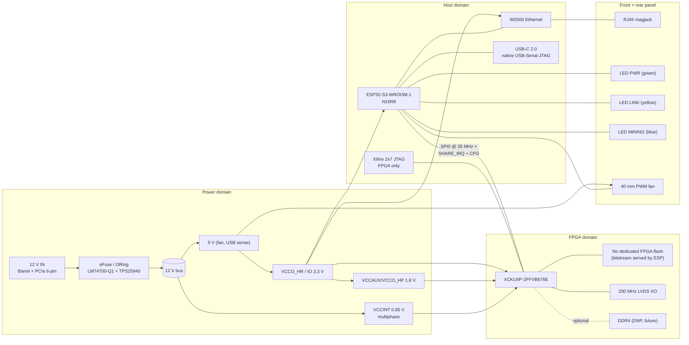
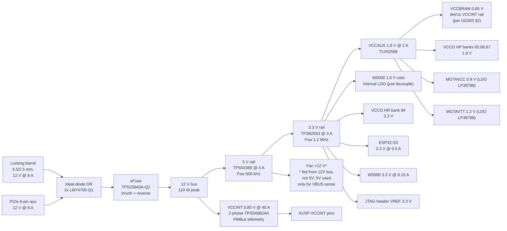
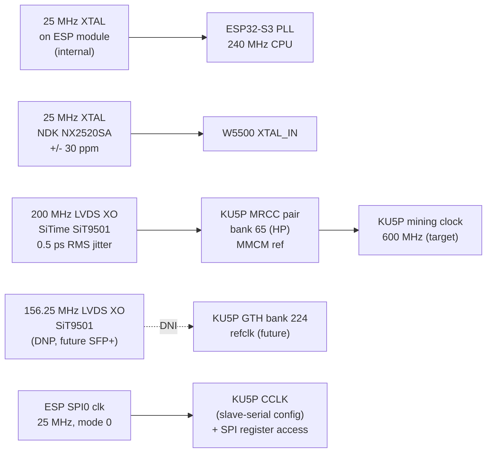

# B3Miner-1 Hardware Schematic — Implementer Reference

**Doc revision:** R0 (draft, 2026-05-18)
**Board revision target:** rev A
**Owning firmware:** [`contrib/miner/b3miner-firmware/`](../b3miner-firmware/)
**Intended audience:** contract PCB design house starting schematic capture, layout,
fab/assembly. Every signal and rail named here is binding on the firmware side
unless an explicit FILL IN tag says otherwise.

---

## 0. Cover sheet

| Field | Value |
|---|---|
| Product name | B3Miner-1 |
| Form factor | Standalone networked appliance (NOT a PCIe add-in card despite "card" nickname) |
| Outline | 120 mm × 80 mm, 1.6 mm FR-4, 8-layer |
| Total mass budget | ≤ 250 g (incl. heatsink + fan) |
| Power envelope | 90 W typical, 110 W peak, 12 V DC input |
| FPGA | Xilinx Kintex UltraScale+ XCKU5P-2FFVB676E |
| Host MCU | Espressif ESP32-S3-WROOM-1-N16R8 (16 MB flash, 8 MB PSRAM) |
| Network | 10/100 Ethernet, RJ45, MDI/MDIX auto |
| User I/O | USB-C 2.0 console + 3 status LEDs + recessed reset button |
| Service I/O | Xilinx 2×7 0.1″ FPGA-JTAG header (top-side) |
| Cooling | 40 × 40 × 10 mm 4-pin PWM axial fan over a finned heatsink |
| Operating env | 0–40 °C ambient, non-condensing, indoor |
| Certifications target | FCC Part 15 B, CE-EMC, RoHS (pre-scan only at R0) |
| Fab class | Standard 8-layer 4/4 mil, no blind/buried vias, ENIG finish |
| Panelisation hint | 2×2 panel with 5 mm rails, V-score on long edge, mouse-bite tabs on short |
| Fab partners considered | JLC PCB (proto), PCBWay (production), TempoAutomation (LF prototypes) |

---

## 1. Issues and resolution required

Before the PCB house proceeds, three items inherited from the firmware tree need
explicit confirmation. They are flagged here so they are not silently absorbed.

### 1.1 Ethernet MAC location vs ESP32-S3 silicon

The current firmware [`sdkconfig.defaults`](../b3miner-firmware/sdkconfig.defaults)
sets `CONFIG_ETH_USE_ESP32_EMAC=y` and
[`main/app_main.c`](../b3miner-firmware/main/app_main.c) calls
`esp_eth_mac_new_esp32()` against a LAN87xx PHY. The ESP32-S3 SoC does **not**
include a built-in Ethernet MAC — only the original ESP32 does. The configuration
as written will fail to compile on `IDF_TARGET=esp32s3`.

Three valid resolutions exist. The board layout depends on which is chosen:

| Option | Host | PHY / MAC | Board impact |
|---|---|---|---|
| **A — recommended** | ESP32-S3 | **Wiznet W5500** SPI Ethernet (MAC+PHY in one chip) | Replace LAN8720A + magjack-only with W5500 + integrated magjack; reuse 25 MHz crystal; drop RMII clock |
| B | Switch host to ESP32-D0WD-V3 | LAN8720A RMII (as planned) | Loses native USB-Serial-JTAG; needs CP2102N for console; smaller flash on most modules |
| C | ESP32-S3 + external EMAC-on-SPI bridge (e.g. KSZ8851SNL) | KSZ8851SNL | Similar pin count to W5500, larger BOM |

This document is written for **Option A (W5500)**, both because it keeps the
ESP32-S3 host (the rest of the firmware uses S3-specific features — native USB,
RGB, 8 MB PSRAM) and because W5500 is the de facto SPI-Ethernet path in
ESP-IDF examples. The pin map below routes Ethernet over a second SPI bus
(`HSPI`) and frees GPIO 23/18 (originally MDC/MDIO) for general I/O.

If the team chooses Option B or C, see §7 (Ethernet subsystem) for the swap
table and pin reassignments.

### 1.2 FPGA bitstream storage

[`components/b3_fpga/README.md`](../b3miner-firmware/components/b3_fpga/README.md)
says the KU5P bitstream lives at flash offset `0x800000`, but
[`partitions.csv`](../b3miner-firmware/partitions.csv) only allocates up to
`0x720000`. The 16 MB module has the physical room (8 MB free above `0x800000`),
but the partition table needs an `fpga, data, 0x82, 0x800000, 0x800000`
entry so the bitstream is not stomped by a future OTA partition resize. This
is a firmware-side fix; the hardware doc assumes the 16 MB flash and reserves
that range.

### 1.3 PHY reset pin

Firmware sets `PIN_ETH_PHY_RST = -1` (PHY reset assumed tied high externally).
W5500 has its own `RSTn` pin which we **do** drive from the ESP — recommended
GPIO 16. Section 7 reflects this.

---

## 2. System block diagram



The four domains map 1-to-1 to the four sections of the floorplan in §12.

---

## 3. Power tree

### 3.1 Diagram



> Note on the fan rail: the diagram annotates that the fan is fed from the
> 12 V bus directly (Sunon 12 V/4-pin part), not from the 5 V step-down. The
> 5 V rail exists only to feed the 3.3 V rail efficiently and to provide
> a 5 V reference for any future Hirose-style stacked option board.

### 3.2 Regulator table

| Rail | Vout | Iout typ / max | Topology | Primary part | Fsw | L (µH) | Cout (µF) | Soft-start | PGOOD destination |
|---|---|---|---|---|---|---|---|---|---|
| 12 V bus | 12 | 7 A typ / 9 A max | passive bus | n/a | n/a | n/a | 2 × 470 (electrolytic) + 4 × 22 (X7R) | n/a | eFuse PG → supervisor |
| 5 V | 5.0 | 1.5 typ / 4 max | sync buck | TI TPS54360 | 500 kHz | 6.8 | 47 + 22 | 4.7 ms | → supervisor |
| 3.3 V | 3.3 | 1.0 typ / 3 max | sync buck | TI TPS62933 | 1.2 MHz | 4.7 | 22 + 22 | 2.4 ms | → supervisor |
| VCCAUX 1.8 | 1.8 | 0.8 typ / 2 max | sync buck | TI TLV62568 | 1.5 MHz | 2.2 | 22 + 22 | 1.0 ms | → supervisor + FPGA INIT_B chain |
| VCCINT | 0.85 | 18 typ / 40 max | 2-phase buck | 2 × TI TPS546B24A | 500 kHz | 2 × 0.47 | 4 × 470 polymer + 12 × 22 X7R | 8.0 ms | → supervisor + FPGA PROG_B chain |
| MGTAVCC | 0.9 | 0.05 typ (unused; just decouple) | LDO | TI LP38798 | dc | n/a | 22 + 0.1 | n/a | DNI in R0; footprint present |
| MGTAVTT | 1.2 | 0.05 typ (unused; just decouple) | LDO | TI LP38798 | dc | n/a | 22 + 0.1 | n/a | DNI in R0; footprint present |

> **Second sources** for each TI part: see §14.

### 3.3 Sequencing

KU5P UG583 §2 mandates: `VCCINT` ≥ `VCCBRAM` (linked here), then `VCCAUX`,
then `VCCO_*`. Enforced by a **TPS386596** quad supervisor monitoring
all four FPGA rails plus the 3.3 V system rail. EN-chain order:

```
EN(VCCINT) ← system PGOOD
EN(VCCAUX) ← PG(VCCINT)
EN(VCCO_HP_1V8) ← PG(VCCAUX)        // shares the VCCAUX rail in R0
EN(VCCO_HR_3V3) ← PG(3.3 V system)  // always on with system
```

`PG_ALL` from the TPS386596 drives an open-drain net to FPGA `PROGRAM_B`
through a 10 kΩ pull-up to 3.3 V. On rail collapse, `PROGRAM_B` falls
within 10 µs, holding the KU5P in config-reset until power returns. The
ESP32-S3 also drives `PROGRAM_B` (GPIO5, per firmware) wired-OR — both
sides may force a reload.

### 3.4 Inrush and reverse-polarity protection

- **Inrush:** TPS25940A configured for 50 ms ramp via `dV/dt` cap on
  the `EN` pin. Limits inrush to < 2 A peak even with 4 × 470 µF bulk.
- **Reverse polarity:** LM74700-Q1 ideal-diode controllers in front of
  both barrel and PCIe inputs (no Schottky drop loss). The OR-ing function
  is implicit — both can be plugged in simultaneously, the higher-V source
  wins.
- **Overvoltage clamp:** SMAJ16CA bidirectional TVS across the 12 V bus
  (16 V standoff, 26 V clamp at 1 A). Sized to survive 60 W of repetitive
  transient.

### 3.5 PCB-layer power planes

VCCINT lives on a dedicated 2 oz copper plane (layer 5) under the KU5P
flip-chip BGA. 12 × 22 µF + 47 µF + 4 × 470 µF polymer caps sit on the
underside of the board centered on the VCCINT ball cluster (UG583 §2.4
"power-island" pattern). All other rails share layer 4 with split planes,
50 mil minimum width.

---

## 4. Clock tree

### 4.1 Diagram



### 4.2 Clock budget

| Source | Frequency | Tol / jitter | Consumer | Notes |
|---|---|---|---|---|
| ESP module xtal | 40 MHz | ±10 ppm | ESP CPU PLL (240 MHz) | Built into WROOM-1, no PCB design needed |
| W5500 xtal | 25 MHz | ±30 ppm | W5500 PHY + MAC | NDK NX2520SA-25M, 8 pF load caps |
| Main FPGA XO | 200 MHz LVDS | ±50 ppm, < 0.5 ps RMS | KU5P MMCM (bank 65) | SiT9501; MMCMs synthesize all mining-domain clocks |
| Future GTH XO | 156.25 MHz LVDS | ±50 ppm, < 0.3 ps RMS | KU5P GTH (bank 224) | **DNI** on R0; pads present for SFP+ uplink option |
| ESP SPI clk | 25 MHz (CMOS) | matches ESP CPU PLL | KU5P SPI slave, also CCLK during config | Originates at ESP GPIO 12 |

### 4.3 Layout rules

- 200 MHz LVDS pair within **5 mm** of KU5P MRCC balls. Length-matched within
  2 mil. 100 Ω differential impedance, no stubs.
- 200 MHz XO sits over a continuous reference plane (layer 2 GND).
- 25 MHz W5500 crystal centered between its two load caps, < 10 mm trace.
- SPI clock from ESP runs as single-ended 50 Ω to KU5P, with a 22 Ω
  series resistor (DNP option, default 0 Ω) at the ESP source for ringing
  control if needed at bring-up.
- All XO power pins decoupled with a 0.1 µF X7R + 10 µF X7R within 2 mm.

### 4.4 RMII / Ethernet clock note

Option A (W5500) **does not need an RMII reference clock** to/from the ESP —
W5500 has its own internal PHY clock generation from the 25 MHz crystal,
and the ESP talks to it over SPI only. This is one of the key wins of
choosing W5500 over RMII PHYs on the S3.

---

## 5. FPGA subsystem (KU5P)

### 5.1 Part selection

| Field | Value |
|---|---|
| Part | XCKU5P-2FFVB676E |
| Package | FFVB676 (676-ball flip-chip BGA, 27 × 27 mm, 1.0 mm pitch) |
| Speed grade | -2 (production) |
| Temp grade | Extended (-40 → +100 °C junction) |
| Logic cells | 475 k |
| DSP slices | 1 824 |
| BRAM | 432 × 36 kb (15.3 Mb) |
| URAM | 1.1 Mb |
| GTH transceivers | 16 lanes @ 16.3 Gb/s (all DNI in R0) |
| I/O banks | 3 HP (65, 66, 67) + 1 HR (84) accessible at FFVB676 |

### 5.2 Bank assignment summary

Detailed ball-by-ball assignment lives in the contract house's pin-planner
file. The hardware doc owns the categorisation:

| Bank | Type | Vcco (R0) | Use | Pin count budget |
|---|---|---|---|---|
| 65 | HP | 1.8 V | KU5P ↔ ESP SPI slave (CCLK on dedicated CCLK ball, MOSI/MISO/CS on free balls), MMCM ref (MRCC pair), share-IRQ output | 8 |
| 66 | HP | 1.8 V | Future DDR4 (DNI footprint, 16-bit interface) | 30 (footprint) |
| 67 | HP | 1.8 V | Spare GPIO bank, brought to a 2×10 0.05″ debug header (DNI) | 16 |
| 84 | HR | 3.3 V | Fan tach in, fan PWM out, FPGA SHARE LED out, JTAG sense | 6 |
| 0 (config) | HR | 3.3 V | `PROGRAM_B`, `INIT_B`, `DONE`, `M[2:0]`, `CCLK_0` (mux), `TCK/TDO/TDI/TMS` | n/a |

### 5.3 Config-mode straps

Configured for **slave-serial** mode so the ESP32-S3 can clock the bitstream
in over the SPI bus that's already wired for register access:

| Strap | Value | Pull | Meaning |
|---|---|---|---|
| `M0` | 1 | 4.7 kΩ → 3.3 V | Slave-serial mode |
| `M1` | 1 | 4.7 kΩ → 3.3 V | |
| `M2` | 1 | 4.7 kΩ → 3.3 V | |
| `CFGBVS` | 1 (VCCO) | direct → VCCO_0 (3.3 V) | 3.3 V config bank |
| `POR_OVERRIDE` | 0 | 10 kΩ → GND | Normal POR |

`PROGRAM_B`, `INIT_B`, `DONE` all bidirectional open-drain with 4.7 kΩ
pull-ups to 3.3 V (VCCO_0). Drive table:

| Net | ESP pin | KU5P pin | Direction at ESP |
|---|---|---|---|
| `PROGRAM_B` | GPIO 5 | PROGRAM_B (config bank) | Output OD; ESP pulls low to reset config |
| `INIT_B` | GPIO 6 | INIT_B (config bank) | Input; low = clearing config memory |
| `DONE` | GPIO 7 | DONE (config bank) | Input; high = bitstream valid |
| `CCLK` (config) | GPIO 12 (SPI_CLK) | CCLK ball + slave-serial input | Output, shared with normal SPI clk |
| `DIN` (config) | GPIO 11 (MOSI) | D00 ball | Output; bitstream LSB-first |

After `DONE` goes high, the same SPI pins flip role to user-mode SPI register
traffic (per [`b3_fpga_regs.h`](../b3miner-firmware/components/b3_fpga/include/b3_fpga_regs.h)).

### 5.4 Decoupling (per UG583)

Per VCCINT ball cluster (~80 balls):

- 12 × 22 µF X7R 0805 (bulk)
- 24 × 4.7 µF X7R 0603 (mid)
- 36 × 0.1 µF X5R 0402 (high-freq)
- 4 × 470 µF polymer (low-ESR bulk, underside)

Per VCCAUX (~20 balls):

- 4 × 22 µF X7R 0603
- 8 × 0.1 µF X5R 0402

Per VCCO bank (per bank):

- 2 × 22 µF X7R 0603
- 6 × 0.1 µF X5R 0402

VCCBRAM shares the VCCINT plane (allowed by UG583 §2 when both are 0.85 V)
and gets 2 × 22 µF + 4 × 0.1 µF dedicated.

### 5.5 Transceiver disposition

GTH quad in bank 224 is unused in R0 but **must be powered** per UG576:

- MGTAVCC (0.9 V), MGTAVTT (1.2 V), MGTVCCAUX (1.8 V) — all decoupled even
  when DNI on the regulators above. Section 3.2 marks both MGT LDOs as DNI
  on R0; the design **assumes a future R1 stuff** option if SFP+ is added.
- RX/TX pads: 50 Ω to GND through a 0 Ω DNI (parking termination, UG576 §2).
- REFCLK pads on bank 224: floated; 156.25 MHz XO footprint present but DNI.

### 5.6 XADC / SYSMON

- `VP/VN` floated (die-temp sensor only — firmware reads it via
  `b3_fpga_read_die_celsius()` over the register map).
- `VREFP` tied to VCCAUX through a 47 Ω ferrite (UG580 §2 recommended path);
  external REF3012 footprint provided but DNI in R0.
- `VREFN` to GND.

### 5.7 Heatsink interface

- Heatsink: 40 × 40 × 25 mm aluminium skived-fin, AAVID-T-Global
  ATS-CPX040040030 or equivalent.
- Mounting: 2 × M3 spring-loaded screws into 4.5 mm tall PCB-mounted
  brass standoffs (Wurth 970040324).
- Thermal interface: t-Global Tflex 720 1.5 mm pad (8.0 W/m·K).
- Recommended thermal compound (alternative): Honeywell PTM7950.

---

## 6. Host subsystem (ESP32-S3)

### 6.1 Module

ESP32-S3-WROOM-1-N16R8 (16 MB external flash, 8 MB PSRAM, on-module
PCB antenna physically present but WiFi/BT both **disabled in
[`sdkconfig.defaults`](../b3miner-firmware/sdkconfig.defaults)**).

The antenna keep-out **is still required** even if WiFi is disabled — the
module datasheet calls for ≥ 15 mm clearance to copper on the antenna axis.
The PCB places the module at the front-left of the board with the antenna
hanging off the edge.

### 6.2 Power

- VDD3P3 (3.3 V) directly from system 3.3 V rail.
- Bulk: 22 µF X7R + 1 µF X7R + 4 × 0.1 µF X5R, < 5 mm from module pads.
- Ferrite bead (BLM18PG471SN1D, 470 Ω @ 100 MHz) optional, DNI default.

### 6.3 Reset and boot

- `EN` pin: 10 kΩ pull-up to 3.3 V, 1 µF X7R to GND, RESET tactile switch
  (Omron B3U-1100P) to GND. Series 470 Ω from button for ESD.
- `GPIO0` (BOOT): 10 kΩ pull-up to 3.3 V, BOOT tactile switch to GND.
- `GPIO3`, `GPIO45`, `GPIO46` (other straps): pulled to their default
  states per ESP32-S3 datasheet table 5 (`GPIO3 = 0, GPIO45 = 0,
  GPIO46 = 0` for SPI boot mode from internal flash).

### 6.4 Strap-pin conflict audit

The firmware uses `GPIO47` and `GPIO48` as the LINK and POWER LEDs.
These are **NOT strap pins** on the S3 (only GPIO0/3/45/46 are sampled at
reset). Confirmed safe.

`GPIO19/20` are reserved for native USB (USB-Serial-JTAG). The firmware
does not touch them. Confirmed safe.

### 6.5 Pin map (locked, must match firmware)

| ESP GPIO | Function | Net | Notes |
|---|---|---|---|
| 0 | BOOT strap | `ESP_BOOT` | Strap + button |
| 3 | Strap (JTAG en) | `ESP_STRAP3` | Pulled low; native USB JTAG used instead |
| 4 | FPGA share IRQ in | `FPGA_SHARE_IRQ` | Input, internal pull-up; firmware `PIN_FPGA_IRQ` |
| 5 | FPGA PROG_B out | `FPGA_PROG_B` | OD output, ext pull-up |
| 6 | FPGA INIT_B in | `FPGA_INIT_B` | Input |
| 7 | FPGA DONE in | `FPGA_DONE` | Input |
| 8 | W5500 INTn in | `W5500_INT` | New, Option A only |
| 9 | W5500 SCSn out | `W5500_CS` | New, Option A |
| 10 | FPGA SPI CS out | `FPGA_SPI_CS` | Firmware `b3_fpga` README |
| 11 | FPGA SPI MOSI out | `FPGA_SPI_MOSI` | Firmware |
| 12 | FPGA SPI CLK out | `FPGA_SPI_CLK` | Firmware; also CCLK during config |
| 13 | FPGA SPI MISO in | `FPGA_SPI_MISO` | Firmware |
| 14 | W5500 SCK out | `W5500_SCK` | New, Option A |
| 15 | W5500 MISO in | `W5500_MISO` | New, Option A |
| 16 | W5500 RSTn out | `W5500_RST` | New, Option A |
| 17 | W5500 MOSI out | `W5500_MOSI` | New, Option A |
| 18 | spare → 2x10 debug header | `ESP_DBG_0` | Was MDIO under Option B |
| 19 | USB D− | `USB_DM` | Native USB |
| 20 | USB D+ | `USB_DP` | Native USB |
| 21 | LED MINING out | `LED_MINING` | Firmware `PIN_LED_MINING` |
| 22 | Fan PWM out | `FAN_PWM` | 25 kHz |
| 23 | Fan tach in | `FAN_TACH` | Was MDC under Option B |
| 35,36,37 | (reserved, octal PSRAM internal) | n/a | Do not route on PCB |
| 38 | RGB onboard LED | `ESP_RGB` | Inside the WROOM module, no PCB route |
| 47 | LED LINK out | `LED_LINK` | Firmware `PIN_LED_LINK` |
| 48 | LED POWER out | `LED_POWER` | Firmware `PIN_LED_POWER` |

> Pins 35–37 are internally bonded to the octal PSRAM on the
> N16R8 module variant. The PCB **must not** route to them.

### 6.6 Firmware deltas required (Option A)

To go with this board, the firmware must change:

- [`sdkconfig.defaults`](../b3miner-firmware/sdkconfig.defaults): set
  `CONFIG_ETH_USE_SPI_ETHERNET=y`, `CONFIG_ETH_USE_ESP32_EMAC=n`.
- [`main/app_main.c`](../b3miner-firmware/main/app_main.c): replace
  `esp_eth_mac_new_esp32` + `esp_eth_phy_new_lan87xx` with
  `esp_eth_mac_new_w5500` + `esp_eth_phy_new_w5500`, and the SPI
  device config on `SPI2_HOST` using the pins in §6.5.
- Drop the `PIN_ETH_MDC`/`PIN_ETH_MDIO`/`PIN_ETH_PHY_*` macros and add
  `PIN_W5500_*` macros consistent with §6.5.

This is documented here so the change is not invisible to the firmware
maintainers.

---

## 7. Ethernet subsystem (W5500)

### 7.1 Device

| Field | Value |
|---|---|
| Part | Wiznet W5500 (LQFP-48, 7 × 7 mm) |
| Interface to host | SPI mode 0 or 3, ≤ 80 MHz (we target 30 MHz to keep margin) |
| PHY | Integrated 10/100 BASE-TX, auto-MDIX, auto-negotiation |
| Power | 3.3 V single supply, internal 1.0 V core LDO |
| Hardware MAC | Yes — fully offloaded from ESP CPU |
| Sockets | 8 hardware sockets (we use 2: Stratum + HTTP) |

### 7.2 Pinout to ESP

See §6.5. Summary: SPI2 (`HSPI`) on GPIO 14/15/17 + CS 9, INT 8, RST 16.

### 7.3 Magjack

- Part: **Pulse Electronics J0011D01BNL** (or HanRun HY911105A as a
  drop-in second source — both are 8-pin RJ45 with integrated 1:1
  isolation transformers, 2 LEDs).
- LED bicolor: green = link, yellow = activity. **Driven by W5500
  LED pins, NOT the ESP front-panel LEDs.**
- Bob-Smith termination: 4 × 75 Ω 1% to a common node, common node to
  chassis ground through a 1 nF, 2 kV ceramic (Murata GA355DR7GF102KW01L).
- ESD: SP0503BAHTG (3-channel TVS, 6 V standoff) on each pair pre-magjack.

### 7.4 Layout rules

- W5500 TX± and RX± pairs run on layer 1 or 3 with continuous GND
  reference, 100 Ω differential, ≤ 50 mm total length, inner-pair length
  match ≤ 5 mil, pair-to-pair match ≤ 50 mil.
- Magjack centered on the front-panel edge, 6 mm from the edge of the
  board outline for connector retention to align with the chassis.
- Cut-out / void in inner GND plane under the magjack secondary side
  (chassis-ground island) — 200 mil minimum.
- 25 MHz crystal placed within 5 mm of W5500 XTAL_IN/OUT, ground
  ring around crystal, two 22 pF load caps tied to a local GND fill.

### 7.5 Power-up sequence

1. 3.3 V comes up.
2. ESP asserts `W5500_RST` low for ≥ 500 µs after 3.3 V settles
   (the W5500 datasheet requires a hardware reset pulse).
3. ESP releases reset, waits 1 ms (W5500 PLL lock).
4. ESP reads `VERSIONR` register (expect `0x04`) to confirm presence.

This is handled by `esp_eth_phy_new_w5500()` in ESP-IDF; the hardware
just needs the `RSTn` line.

---

## 8. USB-C subsystem

### 8.1 Receptacle

- Part: **GCT USB4105-GF-A** (USB-C 2.0-only, mid-mount, vertical SMT,
  16-pin). USB 2.0 only — the C connector has 24 pins, the 2.0-only
  variant breaks out the 16 we use.
- Orientation: rotation-symmetric via D+/D− shorted across A6/A7 = B6/B7.

### 8.2 Pinout

| C pin(s) | Net | Detail |
|---|---|---|
| A1, A12, B1, B12 | GND | All tied to local GND, pour |
| A4, A9, B4, B9 | VBUS | Tied; into TVS + polyfuse, then to "VBUS_SENSE" only |
| A6 ∥ B6 | USB_DP | To ESP GPIO 20 via 22 Ω 0 Ω-DNI series |
| A7 ∥ B7 | USB_DM | To ESP GPIO 19 via 22 Ω 0 Ω-DNI series |
| A5 | CC1 | 5.1 kΩ to GND (Rd, advertises sink) |
| B5 | CC2 | 5.1 kΩ to GND |
| A8, B8 | SBU1/2 | Not connected |
| Shell | EARTH | To chassis-GND island via 1 MΩ in parallel with 4.7 nF |

### 8.3 VBUS handling

The B3Miner-1 is fully powered from its 12 V DC input. **VBUS is not
consumed.** It is gated through:

- 500 mA polyfuse (Bourns MF-MSMF050X-2)
- TVS array (Littelfuse SP3012-04UTG)

The protected node `VBUS_SENSE` lands on ESP `GPIO 8` via a
100 kΩ / 47 kΩ resistive divider, **DNI by default**. (Hook for a future
firmware feature: detect when a console cable is plugged in.) In R0 the
divider footprints are present but unstuffed.

### 8.4 Data lines

- Common-mode choke: ST Micro USBLC6-2P6 between connector and ESP.
- D+ / D− pair: 90 Ω differential, layer 1 only, < 60 mm total,
  reference plane is layer 2 GND.

---

## 9. JTAG subsystem (FPGA only)

### 9.1 Header

- Connector: 2×7 0.1″ (2.54 mm) shrouded pin header (Wurth 61201421621).
- Polarised key on pin 7 cutout.

### 9.2 Pinout (Xilinx 14-pin standard)

| Pin | Net | Notes |
|---|---|---|
| 1 | VREF (3.3 V) | From VCCO_0 |
| 2 | VCC (3.3 V) | Also from VCCO_0, ferrite-isolated |
| 3 | GND | |
| 4 | TMS | KU5P TMS, 4.7 kΩ pull-up |
| 5 | GND | |
| 6 | TCK | KU5P TCK, 1 kΩ pull-down |
| 7 | GND | (key cutout) |
| 8 | TDO | KU5P TDO, 4.7 kΩ pull-up |
| 9 | GND | |
| 10 | TDI | KU5P TDI, 4.7 kΩ pull-up |
| 11–14 | NC / GND | |

### 9.3 Notes

- No level translator: KU5P JTAG bank 0 runs at 3.3 V, header also 3.3 V.
- Header lives on the **side edge** of the board (§12) so a Digilent HS3
  or Platform Cable USB ribbon can hang freely with the heatsink on top.
- **The ESP32-S3 has its own JTAG via native USB.** That goes through
  the USB-C port (§8). The 2×7 header is FPGA-only — labelled
  "FPGA-JTAG" on silkscreen to avoid confusion.

---

## 10. Status LEDs and front panel

Mapping is **binding** on firmware
[`main/app_main.c`](../b3miner-firmware/main/app_main.c) `led_task()`.

| LED | Position | Color | Drive | Behavior |
|---|---|---|---|---|
| PWR | Front-edge, leftmost | Green | ESP GPIO 48, source mode | Solid on after 3.3 V good |
| LINK | Front-edge, middle | Yellow | ESP GPIO 47, source mode | On = Ethernet link up (`b3_events` `ETH_UP`); off = down |
| MINING | Front-edge, right of LINK | Blue | ESP GPIO 21, source mode | Blinks at 5 Hz when `hashrate_khs > 0.1`; off otherwise |
| FPGA-DONE | Top-side, near JTAG header | White | KU5P `DONE` pin direct | On after bitstream valid (hardware-driven, no firmware needed) |
| SHARE-FLICKER | Top-side, near KU5P | Red | KU5P SHARE_IRQ → 100 ms RC one-shot → MOSFET → LED | Visual indicator of share found; not a firmware feature |

### 10.1 Drive parameters

- LED package: T-1¾ (3 mm) thru-hole for front-panel three; 0805 SMD for
  top-side two.
- Forward voltage: 2.0 V (green/yellow/red), 3.0 V (blue), 3.0 V (white).
- Drive current: 2 mA (ESP) / 5 mA (KU5P direct or MOSFET).
- Series resistors (from 3.3 V rail through the LED to GPIO sinking, or
  from GPIO sourcing to LED to GND — the firmware uses **source mode**):
  - Green / Yellow: 680 Ω (≈ 1.9 mA)
  - Blue: 150 Ω (≈ 2.0 mA)
  - White: 150 Ω
  - Red (SHARE one-shot): 220 Ω

### 10.2 Front-panel mechanical

The three front-edge LEDs sit on a 3-on-one-line, 8 mm pitch, 3.5 mm in
from the front edge of the board. A laser-cut polycarbonate light-pipe
strip with three diffuser windows clips onto the chassis. Silkscreen
labels are below each LED on top side: `PWR`, `LINK`, `MINE`.

### 10.3 ESD on user-touchable LEDs

The thru-hole LED leads on the front edge are user-touchable. Each one
gets a TVS to GND (Littelfuse PESD3V3L1BA, 3.3 V standoff) on the
chassis-facing side of the resistor.

---

## 11. Cooling and thermals

### 11.1 Fan

- Part: **Sunon MF40101V2-1000U-A99** (40 × 40 × 10 mm, 12 V, 4-wire PWM,
  ~ 6.5 CFM, ~ 27 dB(A) at 50 % duty).
- 4-pin connector (JST PHR-4 or equivalent), 2.54 mm pitch.
- Wiring: pin 1 = GND, pin 2 = +12 V (from 12 V bus, no per-fan
  switcher), pin 3 = tach (open-collector, 4.7 kΩ pull-up to 3.3 V at
  ESP GPIO 23), pin 4 = PWM (ESP GPIO 22, 25 kHz, push-pull).

### 11.2 PWM and tach handling

- PWM at 25 kHz, drive directly from the ESP (3.3 V logic high is in
  spec for the Sunon PWM input).
- Tach pulse is two-per-revolution (Sunon convention). Firmware computes
  RPM = tach Hz × 30. Used as the metric exported via
  `b3_metrics_snapshot_t::fan_rpm` (future field; not present in R0
  firmware).

### 11.3 Thermal budget

Worst-case at 40 °C ambient, 90 W board power, 60 W of which dissipates
into the KU5P:

| Element | ΔT (°C) | Cumulative T |
|---|---|---|
| Ambient | — | 40 |
| Heatsink-to-air (skived 40 mm, 6.5 CFM) | 22 | 62 |
| TIM (Tflex 720, 1.5 mm, 0.45 °C/W at 60 W) | 27 | 89 |
| Junction-to-case (KU5P -2 spec ≈ 0.12 °C/W) | 7 | **96** |

Junction stays under the 100 °C extended-grade limit with 4 °C margin —
tight. The R0 plan accepts the margin; an R1 should consider:

- Vapor-chamber heatsink (drops the heatsink ΔT by ~ 8 °C)
- Higher-CFM fan (Sanyo Denki 9GA0412P7G001, ~ 12 CFM)
- Adding a temperature interlock in firmware (read XADC die temp via
  `b3_fpga_read_die_celsius()`, throttle the FPGA `nonce_end` range
  if > 90 °C).

### 11.4 Airflow direction

Fan blows **down** onto the heatsink. Front and rear panel of the
chassis are vented; side panels are solid. Recommended chassis: HiBOX
HB-3211 modified, or an SLS-printed enclosure for short-run.

---

## 12. Mechanical envelope

### 12.1 Board outline

```
            (top view, dimensions in mm)
        +---------------------------------+
        |  RJ45  USB-C    PWR LINK MINE  |   <- front edge (Y = 80)
        |   []   [ ]       o    o    o   |
        |                                 |
        |    ESP32-S3                     |
        |    module                       |
        |                                 |
        |              KU5P               |   <- heatsink + fan stack
        |              [###]              |       above this footprint
        |              [###]              |
        |                                 |   2x7 FPGA-JTAG header
        |                                 |   on right edge (X = 120)
        |                                 |   ----> [|||||]
        |   Power section                 |
        |   [Barrel]  [PCIe-6pin]  [Fan]  |   <- rear edge (Y = 0)
        +---------------------------------+
         X = 0                       X = 120
```

### 12.2 Dimensions

- Board outline: **120 mm × 80 mm**.
- Thickness: 1.6 mm ± 10 %.
- Mounting holes: 4 × M3 (3.2 mm drill, 6 mm annular pad GND-stitched),
  on a 110 × 70 mm rectangle, centered (5 mm in from each edge).
- KU5P centroid: (60, 40) — board center.
- ESP32-S3 module: (15, 60), antenna pointing toward the front edge
  with the antenna axis terminating in free air (chassis cutout).
- W5500 + magjack assembly: (18, 75) flush to front edge.
- USB-C: (45, 78) flush to front edge.
- LEDs: x = 70, 78, 86; y = 78 (1 mm in from edge).
- Barrel jack: (15, 4) flush to rear edge.
- PCIe 6-pin: (60, 5) flush to rear edge.
- Fan header: (105, 5) flush to rear edge.
- JTAG 2×7: x = 118, y = 40 (side, right edge).

### 12.3 Z-stack

| Layer | Element | Height (mm) |
|---|---|---|
| Base | PCB top side | 0.0 |
| Components top side | tallest = electrolytic caps near regs | 8.0 |
| KU5P + TIM | flip-chip BGA + thermal pad | 2.5 |
| Heatsink | skived fin block | 25.0 |
| Fan | 40 × 40 × 10 stacked on heatsink | 10.0 |
| **Total z above PCB** | | **35.0** |
| PCB bottom side | components | 2.0 max |
| **Total board envelope** | | **37 mm** |

The 35 mm spec given as the envelope target is met with no margin to
spare for the fan layer. If a chassis vendor needs ≤ 30 mm, drop the
heatsink to 20 mm finned and accept ~ +8 °C junction (still in spec).

### 12.4 3D model deliverables

- STEP AP214 file of the board (full assembly including heatsink and
  fan).
- DXF of the board outline including all cutouts and mounting holes.
- IPC-2581 export from the layout tool.
- IDF 3.0 file for downstream chassis design (optional).

---

## 13. PCB stack-up and impedance

### 13.1 Stack-up (8-layer, 1.6 mm)

| # | Name | Copper | Use |
|---|---|---|---|
| 1 | TOP | 1 oz | Component + signal, USB diff |
| 2 | GND1 | 1 oz | Solid ground reference |
| 3 | SIG-IN1 | 1 oz | High-speed signals: RMII (if Option B), SPI, fast GPIO |
| 4 | PWR1 | 1 oz | 3.3 V + 1.8 V split planes |
| 5 | PWR2 | 2 oz | VCCINT island (under KU5P), 12 V bus elsewhere |
| 6 | SIG-IN2 | 1 oz | FPGA escape routes, slow GPIO |
| 7 | GND2 | 1 oz | Solid ground reference |
| 8 | BOT | 1 oz | Component (bulk caps, DDR4 future), signal |

Dielectric: standard 4 mil prepreg, 8 mil core (typical JLC/PCBWay
8-layer stackup).

### 13.2 Impedance targets

| Pair / line | Target | Layer | Notes |
|---|---|---|---|
| USB D±  | 90 Ω diff | TOP | Common-mode choke between conn and ESP |
| Ethernet TX/RX (W5500 → magjack) | 100 Ω diff | TOP | Bob-Smith on magjack side |
| FPGA SPI clk (single-ended) | 50 Ω SE | TOP / IN1 | 22 Ω series DNI at source |
| Future GTH TX/RX (DNI) | 100 Ω diff | TOP, broadside-coupled | UG576 §3 |
| 200 MHz LVDS clock | 100 Ω diff | TOP, short | < 5 mm from KU5P |

### 13.3 Surface finish

ENIG (Au 3 µ" / Ni 100 µ") on both sides. Required for KU5P BGA
solder-joint reliability; ENIG also gives a good JTAG header life.

### 13.4 Solder mask and silk

- Solder mask: matte black (or dark blue) LPI. (Cosmetic — FILL IN.)
- Silkscreen: white, 6 mil min stroke. All connectors labelled. All
  LEDs labelled. Board revision (`B3MINER-1 R0`) and date code field
  on the bottom side.

---

## 14. BOM strategy

Critical parts with second sources. Full BOM lives in
`hardware/bom.csv` once the contract house produces it.

| Function | Primary MPN | 2nd source | Notes |
|---|---|---|---|
| FPGA | XCKU5P-2FFVB676E | (none — sole source) | Allocate from authorized distributor only |
| Host module | ESP32-S3-WROOM-1-N16R8 | ESP32-S3-WROOM-1-N16R8V (variant with U.FL — same footprint) | Espressif only; both lead-free |
| Ethernet MAC+PHY | Wiznet W5500 | Wiznet W5300S (different package — design alt only) | W5500 has a Korean-origin shortage risk |
| Magjack | Pulse J0011D01BNL | HanRun HY911105A | Drop-in pinout |
| USB-C receptacle | GCT USB4105-GF-A | Amphenol 12401548E4#2A | Same footprint |
| 12 V bus eFuse | TI TPS25940A-Q1 | ADI LTC4368 | Different footprint, layout alt |
| 5 V buck | TI TPS54360 | Monolithic Power MP2451 | Different inductor value (10 µH vs 6.8 µH) |
| 3.3 V buck | TI TPS62933 | ADI MAX17532 | Pin-compatible footprint, recheck Cout |
| 1.8 V buck | TI TLV62568 | Monolithic Power MP2161 | Pin-compatible |
| VCCINT regulator | 2 × TI TPS546B24A | Renesas ISL68224 (single-chip 2-phase) | Different topology, layout alt |
| Supervisor | TI TPS386596 | ADI ADM12914-2 | Different pinout, layout alt |
| Ethernet xtal | NDK NX2520SA-25M | Murata XRCED25M000F1AC0L | Same 8 pF load |
| Main FPGA XO | SiTime SiT9501-AC | Crystek CCHD-957 | Same 7050 footprint |
| Magjack TVS | Littelfuse SP0503BAHTG | Bourns CDDFN10-3304N | Drop-in |
| USB TVS / CMC | ST USBLC6-2P6 | NXP IP4234CZ6 | Drop-in |
| LEDs | Kingbright APT3216SECK | Lite-On LTST-C170 series | Various colors |
| Tact switches | Omron B3U-1100P | C&K KMR2 | Same 4×4 mm footprint |
| Fan | Sunon MF40101V2-1000U-A99 | Sanyo Denki 9GA0412P7G001 | Latter has higher CFM, drop-in |

> **Reel vs cut-tape:** for any production run > 100 units, parts
> ordered on reel only — the assembly house will reject mixed-feed.

---

## 15. Test points and bring-up

### 15.1 Test point list

Mount as 0.040″ thru-hole loops (Keystone 5015), top side, near the rail
they're measuring.

| TP | Net | Expected (idle / load) |
|---|---|---|
| TP1 | 12 V bus | 11.4 – 12.6 V |
| TP2 | 5 V | 4.85 – 5.15 V |
| TP3 | 3.3 V | 3.20 – 3.40 V |
| TP4 | VCCAUX (1.8 V) | 1.75 – 1.85 V |
| TP5 | VCCINT (0.85 V) | 0.825 – 0.875 V, ripple < 20 mV pp |
| TP6 | PG_ALL (supervisor) | 3.3 V when all rails good |
| TP7 | FPGA `DONE` | 0 V during config, 3.3 V after |
| TP8 | FPGA `INIT_B` | 0 V during clear, 3.3 V steady |
| TP9 | ESP `GPIO12` (SPI CLK) | clean 25 MHz square wave during ops |
| TP10 | ESP `GPIO4` (SHARE_IRQ) | low idle, rising-edge per share |
| TP11 | Fan tach | open-collector pulse train, ~ 200 Hz at full RPM |
| TP12 | 200 MHz LVDS clk (+ side only) | sine-shape, ~ 800 mVpp |
| TP13 | W5500 INTn | high idle, low on socket event |
| TP14 | KU5P die temp (via XADC, software read) | < 80 °C at full mining |

### 15.2 Bring-up sequence

Each step references the firmware module/function that proves it.

1. **Power-only smoke test (no programmable parts populated).** Apply
   12 V at the barrel. Confirm rails on TP1–TP5 and PG_ALL on TP6.
   No load — expect all rails low-current. **GO** when all rails are
   in spec and PG_ALL is high.
2. **ESP-only flash.** Populate ESP module (KU5P + W5500 still DNI).
   Connect USB-C. `idf.py -p COMx flash monitor` from
   [`contrib/miner/b3miner-firmware/`](../b3miner-firmware/). Expect
   the `B3Miner-1 firmware boot` log line from `app_main()`. **GO**
   when log appears and no crash.
3. **W5500 populated.** Reboot. Expect `Ethernet started` and
   `Ethernet link up` from `eth_event_handler()` in
   [`app_main.c`](../b3miner-firmware/main/app_main.c). DHCP-assigned
   IP shows up in `IP_EVENT_ETH_GOT_IP`. **GO** when the dashboard
   responds on `http://<ip>:80`.
4. **KU5P populated, bitstream load.** ESP fires the slave-serial
   load path in `b3_fpga_load_bitstream_from_flash()` (currently a
   FILL IN per
   [`IMPLEMENTATION.md`](../b3miner-firmware/IMPLEMENTATION.md)).
   Expect `DONE` (TP7) to go high within 200 ms.
5. **FPGA register handshake.** ESP reads `B3_FPGA_REG_ID` from
   [`b3_fpga_regs.h`](../b3miner-firmware/components/b3_fpga/include/b3_fpga_regs.h);
   must return `0xB3M10001`. **GO** on magic match.
6. **First job.** Configure pool URL via the web UI. Stratum subscribes,
   gets a notify, ESP pushes work to FPGA. **GO** when the mining LED
   begins blinking (`hashrate_khs > 0.1`).
7. **First share.** Wait for `SHARE_IRQ` rising edge (TP10). ESP reads
   nonce + pow hash from the register map, submits to pool, expects
   `result: true`. **GO** on the first accepted share.

### 15.3 Bring-up tooling

- Bench DMM (Fluke 87V or equivalent)
- 100 MHz scope minimum (200 MHz preferred for 200 MHz LVDS clk check)
- Vivado HW Manager + Digilent HS3 cable for FPGA JTAG
- ESP-IDF v5.2 toolchain
- Local Stratum test pool: run the included
  [`contrib/miner/tests`](../tests/) suite against a `regtest`
  `b3chaind` instance

---

## 16. Open items handed to the contract PCB house

The doc owns the engineering decisions; the house owns these
implementation details:

1. **FPGA pin-planner CSV** for KU5P. Use Vivado's
   Bank/Pin-planning to populate the §5.2 bank assignments; supply
   the final CSV back into this repo at
   `b3miner-hardware/pinplan/b3miner_r0.csv`.
2. **Exact regulator MOSFET / inductor part numbers** within the
   §3.2 topologies (sizing constraints are fixed, brand is open).
3. **PCB material** (FR-4 Tg ≥ 170 °C required; vendor open). Note any
   impact on the stack-up dielectric constants.
4. **Connector vendor selections** where §14 lists categories. Stick
   with the second-source list if practical.
5. **Solder-mask color** (cosmetic; default black or dark blue).
6. **Silkscreen revision string** to use for production
   (e.g. `B3MINER-1 R0 2026-W21`).
7. **Stencil thickness** for the KU5P flip-chip BGA (recommended 4 mil
   with NSMD pads — confirm with the assembly house).
8. **Panelisation tabs vs V-score** decision for the 2×2 production
   panel.
9. **3D STEP model** of the final board returned for chassis design.

---

## 17. Out of scope for this doc

Tracked here so they are not forgotten:

- Full KU5P RTL implementing B3PoW-Scratch — separate
  `b3miner-rtl/` tree (future).
- KiCad / Altium project files — produced by the contract house,
  archived back into `b3miner-hardware/pcb/` next pass.
- FCC / CE pre-scan plan — lives in firmware
  [`IMPLEMENTATION.md`](../b3miner-firmware/IMPLEMENTATION.md) Phase 4.
- Enclosure mechanical drawing — produced by the chassis vendor once
  the STEP file (§16 item 9) lands.
- Production test fixture (ICT bed of nails) — separate doc once
  layout settles.

---

## Appendix A — Net naming convention

All schematic nets follow `DOMAIN_FUNCTION[_INDEX]` in UPPER_SNAKE_CASE.

| Prefix | Domain |
|---|---|
| `V*` | Power rail (e.g. `V3V3_SYS`, `VCCINT`, `V12_BUS`) |
| `PG_*` | Power-good signal |
| `EN_*` | Regulator enable signal |
| `FPGA_*` | KU5P pin |
| `ESP_*` | ESP32-S3 pin |
| `W5500_*` | W5500 pin |
| `USB_*` | USB data line |
| `LED_*` | Status LED drive |
| `FAN_*` | Fan-header signal |
| `TP*` | Test point |
| `JTAG_*` | FPGA JTAG signal (TCK/TDI/TDO/TMS/VREF) |

## Appendix B — Document change log

| Rev | Date | Author | Notes |
|---|---|---|---|
| R0 | 2026-05-18 | b3chain | Initial implementer-grade draft. Flagged Ethernet MAC contradiction (§1.1). Chose W5500 (Option A). |
