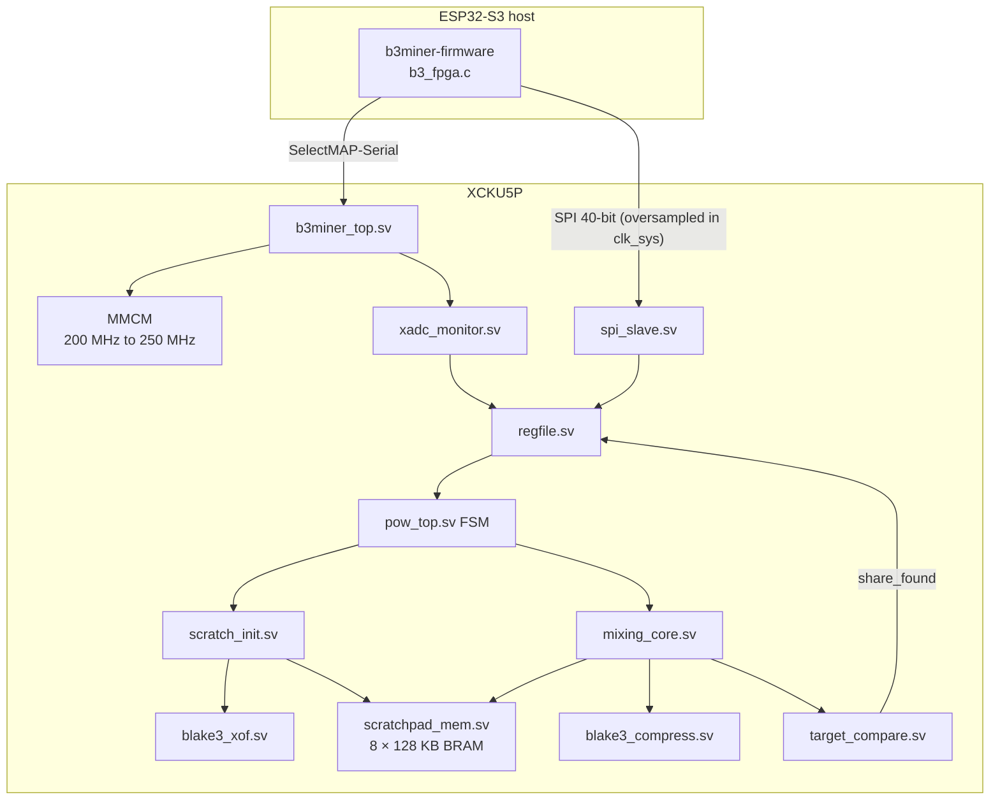
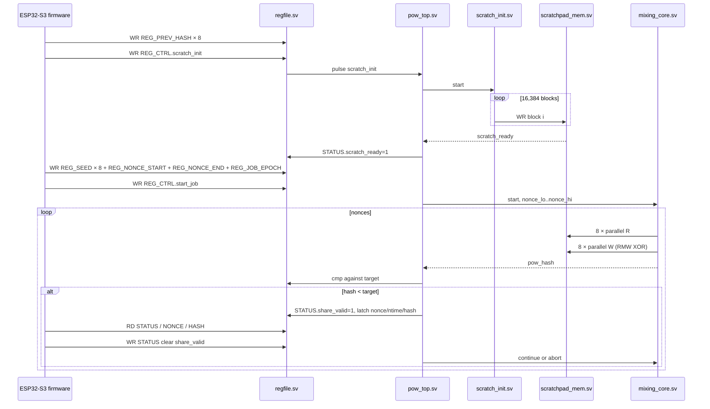

# Architecture

## Data-flow per share attempt

## Clock domains

| Domain | Freq | Source | Used by |
|---|---|---|---|
| `clk_ref` | 200 MHz | bank-65 LVDS XO | MMCM input only |
| `clk_mine` | 250 MHz | MMCM CLKOUT0 | `mixing_core`, `scratchpad_mem`, `pow_top` data path |
| `clk_sys` | 100 MHz | MMCM CLKOUT1 | `regfile`, `spi_slave`, `scratch_init`, `xadc_monitor`, `pow_top` control |
| `clk_spi` (virtual) | 25 MHz | external (ESP32 SCK) | I/O timing only — *no* internal flops on this clock |

**SPI is oversampled in `clk_sys`** (rev-B fix).  The slave 2-FF-syncs
`spi_sck` / `spi_mosi` / `spi_csn` and detects edges on the 100 MHz
clock.  This eliminates the SPI/sys CDC entirely and lets the regfile
drive `req_rdata` combinationally from the live address — fixing the
v1.0 bug where reads returned the previous transaction's data.

CDC crossings that remain are all single-bit synchronisers or async
FIFOs:

| Crossing | Direction | Mechanism |
|---|---|---|
| SPI pins → `clk_sys` | input | 2-FF synchroniser per pin inside `spi_slave.sv` |
| `clk_sys` ↔ `clk_mine` | sys → mine | request pulse + ack handshake |
| `clk_mine` ↔ `clk_sys` | mine → sys | share-found FIFO (depth 4) |

False paths from the SPI input pins are declared in
[`../build/xdc/b3miner_falsepaths.xdc`](../build/xdc/b3miner_falsepaths.xdc).
