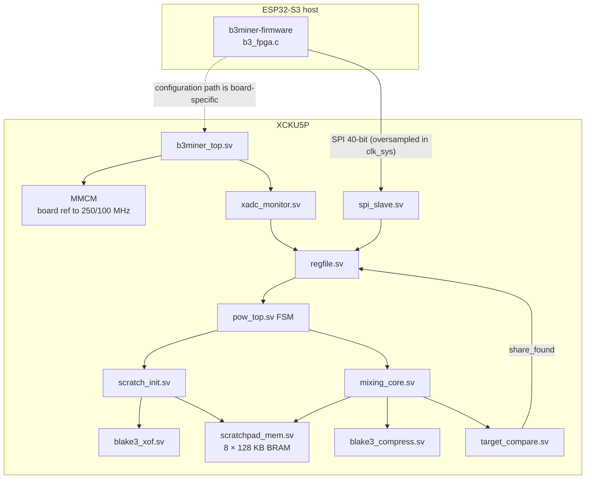
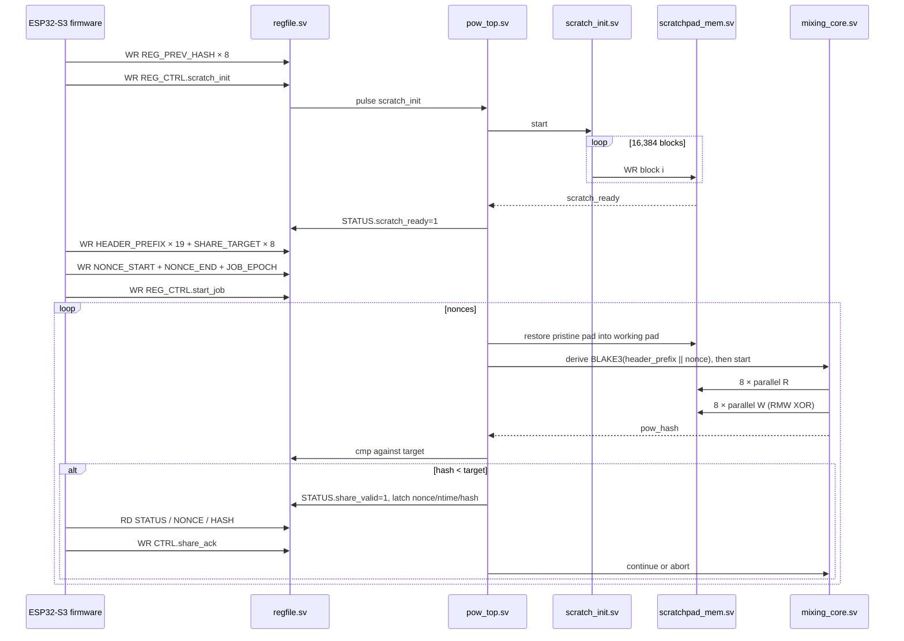

# Architecture

```mermaid
flowchart TD
    subgraph Host[ESP32-S3 host]
        FW[b3miner-firmware<br/>b3_fpga.c]
    end

    subgraph FPGA[XCKU5P]
        top[b3miner_top.sv]
        mmcm["MMCM<br/>board ref to 250/100 MHz"]
        spi[spi_slave.sv]
        rf[regfile.sv]
        pow[pow_top.sv FSM]
        sinit[scratch_init.sv]
        spad[scratchpad_mem.sv<br/>8 × 128 KB BRAM]
        mix[mixing_core.sv]
        b3c[blake3_compress.sv]
        b3x[blake3_xof.sv]
        cmp[target_compare.sv]
        xadc[xadc_monitor.sv]
    end

    FW -. "configuration path is board-specific" .-> top
    FW -- "SPI 40-bit (oversampled in clk_sys)" --> spi --> rf
    rf --> pow
    pow --> sinit --> b3x
    sinit --> spad
    pow --> mix
    mix --> spad
    mix --> b3c
    mix --> cmp
    cmp -- share_found --> rf
    top --> mmcm
    top --> xadc --> rf
```

## Data-flow per share attempt

```mermaid
sequenceDiagram
    participant FW as ESP32-S3 firmware
    participant RF as regfile.sv
    participant PT as pow_top.sv
    participant SI as scratch_init.sv
    participant SP as scratchpad_mem.sv
    participant MX as mixing_core.sv

    FW->>RF: WR REG_PREV_HASH × 8
    FW->>RF: WR REG_CTRL.scratch_init
    RF->>PT: pulse scratch_init
    PT->>SI: start
    loop 16,384 blocks
        SI->>SP: WR block i
    end
    SP-->>PT: scratch_ready
    PT->>RF: STATUS.scratch_ready=1
    FW->>RF: WR HEADER_PREFIX × 19 + SHARE_TARGET × 8
    FW->>RF: WR NONCE_START + NONCE_END + JOB_EPOCH
    FW->>RF: WR REG_CTRL.start_job
    loop nonces
        PT->>SP: restore pristine pad into working pad
        PT->>MX: derive BLAKE3(header_prefix || nonce), then start
        MX->>SP: 8 × parallel R
        MX->>SP: 8 × parallel W (RMW XOR)
        MX-->>PT: pow_hash
        PT->>RF: cmp against target
        alt hash < target
            PT->>RF: STATUS.share_valid=1, latch nonce/ntime/hash
            FW->>RF: RD STATUS / NONCE / HASH
            FW->>RF: WR CTRL.share_ack
            PT->>MX: continue or abort
        end
    end
```

## Clock domains

| Domain | Freq | Source | Used by |
|---|---|---|---|
| `clk_ref` | 200 MHz generic / 100 MHz XCKU5P board profile | differential XO | MMCM input only |
| `clk_mine` | 250 MHz | MMCM CLKOUT0 | `mixing_core`, `scratchpad_mem`, `pow_top` data path |
| `clk_sys` | 100 MHz | MMCM CLKOUT1 | `regfile`, `spi_slave`, `xadc_monitor`, CDC endpoint |
| `clk_spi` (virtual) | 5 MHz | external (ESP32 SCK) | I/O timing only — *no* internal flops on this clock |

**SPI is oversampled in `clk_sys`** (rev-B fix).  The slave 2-FF-syncs
`spi_sck` / `spi_mosi` / `spi_csn` and detects edges on the 100 MHz
clock.  This eliminates the SPI/sys CDC entirely and lets the regfile
drive `req_rdata` combinationally from the live address — fixing the
v1.0 bug where reads returned the previous transaction's data.

CDC crossings are implemented in `miner_cdc_bridge.sv`:

| Crossing | Direction | Mechanism |
|---|---|---|
| SPI pins → `clk_sys` | input | 2-FF synchroniser per pin inside `spi_slave.sv` |
| `clk_sys` → `clk_mine` | sys → mine | toggle/ack command mailbox; payload held until ack |
| `clk_mine` → `clk_sys` | mine → sys | one-entry async share FIFO with explicit firmware ack |
| hash counter | mine → sys | Gray-code synchronizer |

The `xcku5p-2ffvb676` board profile uses H23/H24 `DIFF_SSTL12`,
external termination, and a 100 MHz → 250/100 MHz MMCM. Its ESP32 is
connected to user-mode SPI only; configuration remains volatile JTAG unless
the onboard FPGA QSPI path receives separate authorization.

False paths from the SPI input pins are declared in
[`../build/xdc/b3miner_falsepaths.xdc`](../build/xdc/b3miner_falsepaths.xdc).
