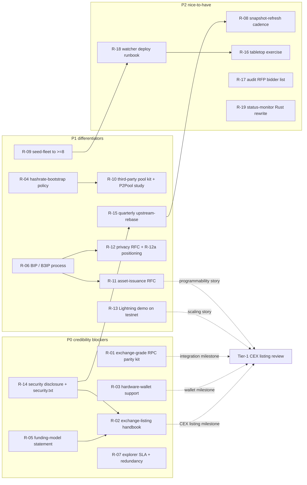

# PoW Peers Roadmap — Closing the Gap to Top-10

**Status:** draft v1.0
**Last updated:** 2026-05-19
**Companion:** [`POW-PEERS-COMPETITIVE-ANALYSIS.md`](POW-PEERS-COMPETITIVE-ANALYSIS.md)
**De-dupe target:** the in-flight launch-package plan tracked at
`.cursor/plans/b3pow-scratch_launch_package_c6f10175.plan.md`. Every R-item
below explicitly states whether it overlaps existing launch-package todos
(`p0_align`, `p1_whitepaper`, `p1_repo`, `p1_bench`, `p1_testnet`,
`p1_article`, `p2_*`, `p3_*`) so this roadmap is **additive**, not duplicative.

---

## Table of contents

- [Item format](#item-format)
- [Tier rules](#tier-rules)
- [P0 — credibility blockers](#p0--credibility-blockers)
- [P1 — top-10 differentiators](#p1--top-10-differentiators)
- [P2 — nice-to-have](#p2--nice-to-have)
- [Sequencing diagram](#sequencing-diagram)
- [What we explicitly are not building](#what-we-explicitly-are-not-building)

---

## Item format

Each work item is structured as:

```
### R-NN — short title
- **Tier:** P0 / P1 / P2
- **Source:** §X of POW-PEERS-COMPETITIVE-ANALYSIS.md (which peer / section suggested it)
- **Type:** consensus / behavioural / RPC / ops / docs / website
- **In-tree home:** src/... or contrib/... or doc/... (proposed)
- **Acceptance:** one-line "definition of done"
- **Pre-reqs:** list of other R-NN items (or "none")
- **Risk:** low / med / high (with one line of justification)
- **De-dupe note:** explicit relationship to the in-flight launch-package
  plan (`.cursor/plans/b3pow-scratch_launch_package_c6f10175.plan.md`).
  Either "additive — no overlap with `p0_align` / `p1_*` / `p2_*` / `p3_*`"
  or "extends `p3_audit` (specifically the bidder-named RFP step)" etc.
```

## Tier rules

- **P0 — credibility blockers.** Must ship before a serious exchange
  listing or external security audit. Without these, every later
  effort is multiplied by zero. Five items.
- **P1 — top-10 differentiators.** Features and decisions that move
  b3chain from "another conservative Bitcoin fork" to "a chain a
  sophisticated buyer recognises as having its own thesis". Includes
  written-decision items where "we explicitly defer indefinitely"
  is an acceptable acceptance criterion. Seven items.
- **P2 — nice-to-have.** Ecosystem polish that compounds but does
  not block listings, audits, or launch. Six items.

Numbering is sequential across all tiers (R-01 .. R-19) so that
external references to a specific R-NN remain stable as items are
reshuffled between tiers.

## P0 — credibility blockers

### R-01 — Exchange-grade RPC parity & integration kit

- **Tier:** P0
- **Source:** §5.6 (Ecosystem accelerants); §3.10
- **Type:** ops + docs + small code
- **In-tree home:** `doc/exchanges/RPC-PARITY.md` (audit + checklist);
  `contrib/exchange-integration/` (example Python + TypeScript clients
  + Docker-composed `electrs`-equivalent address-index daemon);
  `doc/policy/REPLACE-BY-FEE.md` (RBF policy statement).
- **Acceptance:** A tier-1-CEX integration engineer can stand up a
  full b3chain custody integration in ≤4 hours starting from
  `doc/exchanges/`. Documented topics: JSON-RPC parity vs bitcoind
  30.2.0 (diff list), ZMQ topics published, REST endpoints,
  WebSocket push, address-index daemon, RBF / package-relay
  policy, mempool-eviction policy, fee-estimation method,
  chain-tip notification.
- **Pre-reqs:** none.
- **Risk:** low. We are a Bitcoin Core 30.2.0 fork; 90 % of the
  surface is identical. Risk is "we miss a small policy difference
  that bites a custodian under load".
- **De-dupe note:** Additive. The launch-package plan's `p2_repro`
  ships Docker / Guix reproducible builds; this item ships the
  *integration-engineer-facing* docs and example clients on top.
  No overlap with `p1_*` testnet items (those are operator-facing,
  not integrator-facing).

### R-02 — Exchange-listing handbook

- **Tier:** P0
- **Source:** §5.6; §3.10
- **Type:** docs
- **In-tree home:** `doc/exchanges/LISTING-HANDBOOK.md`.
- **Acceptance:** A listing-committee analyst can fill out the
  internal "new asset risk review" template using only this
  document and linked references. Required contents: ticker
  (`B3`), decimals (8), HRP (`b3`), genesis-block hash, M-8
  emergency checkpoint hash (if set), `max_reorg_depth` value,
  network-upgrade calendar, security-contact (GPG-keyed) email,
  audit-report links, source-code provenance, funding-model
  pointer (R-05), threat-model pointer
  ([`B3POW-51-ATTACK-ANALYSIS.md`](../security/B3POW-51-ATTACK-ANALYSIS.md)),
  monetary-policy statement (no premine / no founders' reward /
  no dev tax / 21 M cap).
- **Pre-reqs:** R-05 (funding model), R-14 (security disclosure).
- **Risk:** low. Document collation only.
- **De-dupe note:** Additive. Launch-package `p3_audit` ships the
  audit RFP package itself; this handbook is the
  *exchange-listing-committee-facing* wrapper that points at it.

### R-03 — Hardware-wallet support matrix + integration PRs

- **Tier:** P0
- **Source:** §5.6 (item 3); §3.10
- **Type:** ops + upstream PRs
- **In-tree home:** `doc/wallets/HARDWARE-SUPPORT.md` (matrix);
  `contrib/wallets/ledger-bolos-app/` (in-tree mirror of upstream
  Ledger app fork); `contrib/wallets/trezor-firmware/` (same for
  Trezor); SLIP-0044 coin-type registration PR
  ([github.com/satoshilabs/slips](https://github.com/satoshilabs/slips)).
- **Acceptance:** Ledger Nano S Plus + Trezor Model T can both
  receive and spend B3 with on-device address verification using
  BIP44/49/84/86 paths under the b3chain SLIP-0044-registered
  coin type. Public PRs filed against `LedgerHQ/app-bitcoin-new`
  and `trezor/trezor-firmware`.
- **Pre-reqs:** SLIP-0044 coin-type assignment (external —
  satoshilabs review).
- **Risk:** medium. External-PR review timeline is not under our
  control; SLIP-0044 maintainers may push back on a new
  Bitcoin-fork registration.
- **De-dupe note:** Additive. Launch-package has no hardware-wallet
  workstream.

### R-05 — Funding-model statement

- **Tier:** P0
- **Source:** §5.7 (item 1); §4.6 (ZEC two-org), §4.7 (XMR CCS)
- **Type:** docs
- **In-tree home:** `doc/FUNDING.md`.
- **Acceptance:** A two-page document stating: (a) zero premine,
  zero founders' reward, zero dev tax — committed; (b) how
  ongoing development is funded (sponsorships, grants, voluntary
  CCS-style per-work-item funding, …); (c) conflict-of-interest
  policy for contributors paid by external sponsors; (d)
  treasury-management policy (or explicit "no treasury exists");
  (e) the funding statement is linked from `README.md` and
  `doc/exchanges/LISTING-HANDBOOK.md`.
- **Pre-reqs:** none.
- **Risk:** low. Written-decision document only.
- **De-dupe note:** Additive. No funding statement exists in the
  launch-package plan; `p1_repo` covers `CONTRIBUTING.md` and
  `CODE_OF_CONDUCT.md` only.

### R-07 — Production block-explorer SLA

- **Tier:** P0
- **Source:** §5.6 (item 4); §3.10
- **Type:** ops + infra
- **In-tree home:** `doc/operations/EXPLORER-SLA.md`; deployment
  scripts under `contrib/deploy/explorer/`.
- **Acceptance:** At least two independent block explorers reachable
  at separate domains, hosted in different regions, with a public
  uptime page targeting ≥99 % monthly. The internal one stays at
  `seed1`; a second explorer is hosted on a different VPS
  (different ASN) with separate seed-list and separate maintainer
  on-call.
- **Pre-reqs:** none.
- **Risk:** medium. Operational cost (a second VPS) and on-call
  rotation discipline are real ongoing investments.
- **De-dupe note:** Extends `p2_repro` (which builds the explorer
  reproducibly) and `p1_testnet` (which deploys the current
  single explorer). This R-item is the *redundancy and SLA*
  layer the launch-package plan does not cover.

### R-14 — Security disclosure policy + `security.txt`

- **Tier:** P0
- **Source:** §5.7 (item 3); §4.1 (BTC bug-bounty pipeline)
- **Type:** docs + website
- **In-tree home:** `SECURITY.md` (repo-root, GitHub-recognised);
  `b3chain-website/.well-known/security.txt` (RFC 9116 format);
  `doc/security/DISCLOSURE-POLICY.md`.
- **Acceptance:** Public GPG-signed `security@b3chain.org` contact;
  RFC 9116-compliant `security.txt` deployed at
  `https://b3chain.org/.well-known/security.txt`; written ≤72h
  acknowledgement SLA; public commitment to CVE issuance for
  fixed vulnerabilities; coordinated-disclosure expectations
  spelled out; bounty range stated (or "no bounty programme yet —
  contact us for case-by-case").
- **Pre-reqs:** none.
- **Risk:** low. Documentation + DNS + website file deployment.
- **De-dupe note:** Extends `p3_audit` (which ships
  `security/bug-bounty.md` and the audit RFP package). This R-item
  is the *standing public-facing security contact* — different
  artefact from the audit RFP itself.

## P1 — top-10 differentiators

### R-04 — Hashrate-bootstrap policy

- **Tier:** P1
- **Source:** §5.1 (item 1); §4.2 (LTC AuxPoW lesson), §4.10 (RVN NiceHash attacks), §4.7 (XMR no-rented-hashrate baseline)
- **Type:** docs (written decision) + potentially consensus (if AuxPoW chosen)
- **In-tree home:** `doc/policy/HASHRATE-BOOTSTRAP.md` (decision document); if AuxPoW chosen, `src/auxpow/` and `src/primitives/auxpow.{h,cpp}`; if subsidy-curve chosen, `contrib/testnet/faucet/mining-subsidy.md` + faucet logic patch; if "do nothing", a short rationale memo.
- **Acceptance:** Written, signed-off decision selecting exactly one of:
  - (a) **Reserve coinbase-tx commitment bytes for future AuxPoW header** (cheap, future-proof, does *not* enable merge-mining at genesis but keeps the option open via a soft fork).
  - (b) **Faucet-funded mining-subsidy curve** for weeks 0–12, with a defined budget cap and explicit sunset.
  - (c) **Rely on M-4 + algorithm uniqueness — no structural bootstrap aid** (with risk analysis documented).
  Decision must be approved before mainnet genesis. If (a), the bytes are reserved in the genesis coinbase script. If (b), the faucet-funded subsidy is plumbed in `contrib/testnet/faucet/`.
- **Pre-reqs:** none.
- **Risk:** medium-to-high. (a) is low-risk technically but high-risk politically (do we ever activate AuxPoW). (b) is medium-risk (faucet operator becomes a single point of trust). (c) is the highest-risk bet on M-4 alone.
- **De-dupe note:** Additive. Launch-package plan does not address bootstrap-hashrate policy explicitly; `p1_testnet` ships the reference testnet pool but not the bootstrap economics.

### R-06 — BIP / B3IP process + renumber M-1 .. M-14

- **Tier:** P1
- **Source:** §5.7 (item 2); §4.1 (BTC BIPs), §4.5 (ETC ECIPs), §4.6 (ZEC ZIPs)
- **Type:** docs
- **In-tree home:** `doc/bips/README.md` (process); `doc/bips/B3IP-0001.md` ... `doc/bips/B3IP-0014.md` (one per mitigation); `doc/bips/B3IP-0000.md` (template).
- **Acceptance:** `doc/bips/README.md` defines the b3chain improvement-proposal process. Each existing M-1 .. M-14 mitigation has a corresponding B3IP-NNNN document (renumber-only — no consensus change) cross-linked to the consensus source file and the threat-model section it addresses. Process explicitly adopts upstream BTC BIPs by reference (BIP-141 Segwit, BIP-340 Schnorr, BIP-341 Taproot, BIP-94 timewarp, etc.) without renumbering them.
- **Pre-reqs:** none.
- **Risk:** low. Documentation refactor.
- **De-dupe note:** Additive. Launch-package plan has no improvement-proposal process workstream.

### R-09 — Seed-node growth to ≥8 geographically distributed nodes

- **Tier:** P1
- **Source:** §5.1 (item 2); §3.6
- **Type:** ops + infra
- **In-tree home:** `src/kernel/chainparams.cpp::vSeeds` (DNS seeders); `contrib/seeds/nodes_main.txt` (hardcoded seed list); `doc/operations/SEED-FLEET.md`.
- **Acceptance:** Mainnet genesis ships with ≥8 reachable seed nodes spread across ≥4 geographic regions and ≥4 ASNs. Each seed is monitored (uptime, peer count, height). DNS seeders for `seed.b3chain.org` resolve to ≥3 seed addresses with TTL ≤300 s.
- **Pre-reqs:** none.
- **Risk:** medium. Recurring operational cost; on-call coverage.
- **De-dupe note:** Extends `p1_testnet` (current 3 seed nodes are testnet only). This R-item is the *mainnet seed fleet* expansion.

### R-10 — Third-party pool onboarding kit + P2Pool feasibility study

- **Tier:** P1
- **Source:** §5.1 (item 3); §4.7 (XMR P2Pool)
- **Type:** ops + docs + feasibility study
- **In-tree home:** `doc/pool-operator-guide.md` (extension); `contrib/testnet/pool/` (already exists — operator-friendly fork referenced by launch-package `p3_pool`); new `doc/analysis/P2POOL-FEASIBILITY.md`.
- **Acceptance:** Three artefacts:
  - (a) A "stand up a competing b3chain pool in <1 day" operator guide, end-to-end, with Docker-compose reference deployment.
  - (b) Public list of ≥3 third-party pool operators with at least one *running* a public B3PoW-Scratch pool by mainnet T+90 d.
  - (c) Written P2Pool feasibility study (`P2POOL-FEASIBILITY.md`) covering: license compatibility (GPL-2.0), required PoW-validation port, difficulty algorithm fit, estimated effort, recommendation.
- **Pre-reqs:** R-04 (hashrate-bootstrap policy may interact).
- **Risk:** medium. Recruiting third-party pool operators is a marketing/community effort with uncertain timeline.
- **De-dupe note:** Extends `p3_pool` (operator-friendly fork). This R-item adds the *recruitment, P2Pool study, and SLA tracking* layer.

### R-11 — Asset-issuance RFC

- **Tier:** P1
- **Source:** §5.4 (item 1); §4.4 (BCH CashTokens), §4.10 (RVN assets), §4.1 (BTC Ordinals/Runes lesson)
- **Type:** docs (written decision) + potentially consensus (if any asset model chosen)
- **In-tree home:** `doc/bips/B3IP-XXXX-asset-issuance.md` (RFC); cross-link from `doc/strategy/POW-PEERS-COMPETITIVE-ANALYSIS.md §5.4`.
- **Acceptance:** RFC evaluates exactly four alternatives:
  - (a) Ravencoin-style asset opcodes (rich, mature, consensus-level).
  - (b) CashTokens-style UTXO commitments (clean, BCH-tested since 2023).
  - (c) Covenants-via-`OP_CTV` / `OP_CAT` (would require BIP activation ahead of BTC — risky).
  - (d) "Inscriptions-equivalent" / no consensus change (fits BTC parity philosophy but cedes UX ground).
  RFC ends with a single written recommendation (which can be "defer indefinitely — re-evaluate at v2.0" if that is the conclusion). Recommendation is approved through R-06 B3IP process.
- **Pre-reqs:** R-06 (B3IP process).
- **Risk:** high if any consensus-level option is selected (new opcodes, new audit surface); low if "defer" is selected.
- **De-dupe note:** Additive. Launch-package plan does not address asset issuance; this is the most-asked exchange-listing question that the launch package doesn't already cover.

### R-12 — Privacy upgrade RFC + R-12a "no privacy as a feature" positioning

- **Tier:** P1
- **Source:** §5.3; §4.6 (ZEC), §4.7 (XMR), §4.2 (LTC MWEB)
- **Type:** docs (written decision)
- **In-tree home:** `doc/bips/B3IP-XXXX-privacy.md` (RFC); `doc/positioning/NO-PRIVACY-AS-A-FEATURE.md` (R-12a marketing statement).
- **Acceptance:** RFC evaluates exactly four alternatives:
  - (a) Confidential Transactions (Elements / Liquid pattern).
  - (b) Mimblewimble extension block (LTC-MWEB pattern).
  - (c) Taproot + CoinJoin patterns + silent payments (BIP352) — wallet-level only, no consensus change.
  - (d) "Defer indefinitely — transparent chain by design".
  RFC ends with a single written recommendation. Separately, R-12a publishes a positioning statement explaining the trade-off (regulatory clarity, listing-friendly) as a *feature*, not an omission — linked from `README.md` and `b3chain-website/index.html`.
- **Pre-reqs:** R-06 (B3IP process).
- **Risk:** high if (a) or (b) is selected (multi-year audit programme on the order of ZEC's Halo 2); low if (c) or (d).
- **De-dupe note:** Additive. Launch-package plan has no privacy workstream.

### R-13 — Lightning compatibility statement + reference channel demo on testnet

- **Tier:** P1
- **Source:** §5.5; §3.3
- **Type:** ops + docs + small code (LND fork chain-params)
- **In-tree home:** `doc/scaling/LIGHTNING.md` (compatibility statement, channel-open recipe); `contrib/lightning/lnd-b3chain-params/` (LND `chainreg` fork or upstream PR).
- **Acceptance:** One published end-to-end demo: LND running against b3chain testnet, channel opened between two LND nodes, sample HTLC payment routed, channel closed cooperatively. All artefacts (config, channel-open tx, payment HTLC, close tx) recorded under `contrib/lightning/demo-r0/`. Compatibility statement enumerates every Bitcoin Script / Taproot feature LND depends on and confirms b3chain parity. Either: (a) upstream LND PR submitted, or (b) maintained b3chain fork tracking LND release cadence.
- **Pre-reqs:** none.
- **Risk:** low technically (script parity is by construction); medium operationally (LND chain-registration is non-trivial).
- **De-dupe note:** Additive. Launch-package has no Lightning workstream.

### R-15 — Quarterly upstream-rebase commitment

- **Tier:** P1
- **Source:** §4.3 (DOGE Core 0.12 lag lesson)
- **Type:** docs (process commitment)
- **In-tree home:** `doc/MAINTENANCE.md`.
- **Acceptance:** Public maintenance schedule committing to: (a) evaluate each Bitcoin Core minor release within 90 d of upstream release; (b) cherry-pick non-consensus improvements quarterly; (c) publish a "why not" memo for any upstream change deliberately not cherry-picked; (d) cherry-pick *all* security fixes within 30 d of public disclosure. Schedule is linked from `README.md`.
- **Pre-reqs:** R-14 (security disclosure policy — defines the security-fix track).
- **Risk:** low documentation, medium ongoing maintenance burden (real engineering cost over time).
- **De-dupe note:** Additive. Launch-package mentions upstream cherry-pick discipline only in passing (`README.md` line 174-175). This R-item formalises it.

## P2 — nice-to-have

### R-08 — Live-data snapshot refresh discipline

- **Tier:** P2
- **Source:** §2.2; §5.6 (item 5)
- **Type:** docs (process)
- **In-tree home:** `doc/strategy/SNAPSHOT-DISCIPLINE.md`; calendar entry referenced from `doc/MAINTENANCE.md` (R-15).
- **Acceptance:** Quarterly cadence committed: re-snapshot all live-data cells in `POW-PEERS-COMPETITIVE-ANALYSIS.md §3` (hashrate, market cap, exchange count, pool concentration, average tx fee). Refresh PR labelled `snapshot:YYYY-MM-DD`. Last-refresh date updated in document header.
- **Pre-reqs:** R-15 (maintenance calendar).
- **Risk:** low. Process discipline.
- **De-dupe note:** Additive. Snapshot refresh is a recurring task new to this roadmap.

### R-16 — Public tabletop exercise for ETC-style attack scenario

- **Tier:** P2
- **Source:** §5.2 (item 1); §4.5 (ETC attacks)
- **Type:** docs (tabletop exercise)
- **In-tree home:** `doc/security/TABLETOP-EXERCISE-R0.md` (first exercise; numbered so further exercises can land as TABLETOP-EXERCISE-R1, R2, …).
- **Acceptance:** A complete walkthrough document fabricating a hypothetical ETC-style 7000-block reorg attempt against b3chain mainnet at a specified mainnet height. Walks step-by-step through detection (per `51-MONITORING-OPS.md`), classification, runbook execution (per `RESPONSE-RUNBOOK-51ATTACK.md`), expected defensive behaviour (M-3 throttling, M-4 rejection, M-5 ban-score), exchange notification timeline, post-mortem template. Includes mock `getchaintips` / `debug.log` outputs.
- **Pre-reqs:** R-18 (watcher detector deployment runbook — so the detection step is real, not aspirational).
- **Risk:** low. Documentation exercise.
- **De-dupe note:** Additive. Launch-package plan does not include tabletop exercises; existing security docs cover real-incident response but not pre-incident drills.

### R-17 — Bound the audit RFP with named bidders and budget range

- **Tier:** P2
- **Source:** §5.2 (item 2); §4.6 (ZEC NCC / Trail of Bits)
- **Type:** docs (extends existing RFP)
- **In-tree home:** `doc/audit/RFP.md` (already exists per launch-package `p3_audit`); add `doc/audit/BIDDER-LIST.md`.
- **Acceptance:** Named-bidder list with contact pointers: NCC Group, Trail of Bits, Cure53, Quarkslab, Quantstamp (or successor list). Published budget range (USD lower/upper). Each bidder solicitation tracked under `doc/audit/bids-r0/` (initially empty). Decision deadline calendar.
- **Pre-reqs:** Launch-package `p3_audit` completion (the underlying RFP package).
- **Risk:** low. Documentation + outreach.
- **De-dupe note:** Extends `p3_audit`. This R-item is specifically the *bidder-naming + budget-bounding* layer the existing RFP does not cover.

### R-18 — Watcher-detector deployment runbook

- **Tier:** P2
- **Source:** §5.2 (item 3)
- **Type:** ops
- **In-tree home:** `doc/operations/WATCHER-DEPLOY.md`; `contrib/monitoring/systemd/b3chain-51attack-watch.service` (systemd unit file).
- **Acceptance:** Production-deployment runbook for `contrib/monitoring/51attack-watch.py`: systemd unit file, restart policy, log destination, metric export (Prometheus textfile collector or push-gateway), alerting channel (PagerDuty / Signal / Matrix configuration), on-call rotation template, escalation matrix. Deployed on all mainnet seed nodes by mainnet T+30 d.
- **Pre-reqs:** R-09 (seed-fleet expansion).
- **Risk:** low. Operations work.
- **De-dupe note:** Extends `p3_audit` indirectly (the watcher script ships under that umbrella) — but the *deployment runbook* is net-new.

### R-19 — Optional Rust rewrite of testnet status-monitor

- **Tier:** P2
- **Source:** §4.9 (KAS rusty-kaspa lesson)
- **Type:** code
- **In-tree home:** `contrib/testnet/status-monitor/` (current implementation); `contrib/testnet/status-monitor-rs/` (proposed Rust rewrite).
- **Acceptance:** Rust implementation of the testnet status monitor with `Tokio` async runtime, identical JSON output schema as the current implementation. Feature-flagged so the existing implementation continues to ship until the Rust one is operationally proven.
- **Pre-reqs:** none.
- **Risk:** low. Pure infrastructure; existing tool keeps working.
- **De-dupe note:** Refactors `p1_testnet` (which deployed the current status-monitor). Explicitly *optional* — not blocking anything.

## Sequencing diagram



**Critical path to next investor / exchange-facing milestone:**
R-14 → R-05 → R-02 → (parallel) R-01 + R-03 + R-07 → tier-1 CEX
listing review readiness. R-13 (Lightning demo) and R-11 (asset RFC)
strengthen the same review but are not blockers.

## What we explicitly are not building

These are deliberate, documented non-goals. Each is a recurring "why
don't we just add X" question with a written answer to cut it off.
Each links to the analysis-document section that argues the case.

### NB-1 — ChainLocks-style automatic finality via permissioned overlay

**Why not.** Requires a masternode collateral entry barrier (DASH:
1000 DASH ≈ $30k) that centralises consensus-finality power among
capitalised holders, and creates a permissioned quorum the protocol
itself depends on. Philosophically incompatible with the "FPGA
hobbyist + small operator" positioning B3PoW-Scratch was designed for.
See [`POW-PEERS-COMPETITIVE-ANALYSIS.md §4.8`](POW-PEERS-COMPETITIVE-ANALYSIS.md#48-dash-dash).

**Our alternative.** M-14 *operator-pinned* finalize/park RPCs ship
the recovery ergonomics (mirroring BCH-N's API surface) without the
masternode quorum or the auto-finality permanence. See
[`../CHANGELOG.md`](../CHANGELOG.md) v1.1.3.

### NB-2 — Auto-finalization at fixed depth (BCH-N pattern)

**Why not.** A healthy network partition that resolves cleanly under
PoW becomes a permanent split the moment the deeper branch's last
block crosses the auto-final threshold. BCH-N operators have hit this
in practice; both BCH-N and we have rejected the pattern. See
[`../security/B3POW-51-ATTACK-ANALYSIS.md §4.4`](../security/B3POW-51-ATTACK-ANALYSIS.md)
and [`POW-PEERS-COMPETITIVE-ANALYSIS.md §4.4`](POW-PEERS-COMPETITIVE-ANALYSIS.md#44-bitcoin-cash-bch).

**Our alternative.** M-4 hard `max_reorg_depth = 200` (consensus
rejection) plus M-14 operator-pinned finalize (reversible, opt-in).

### NB-3 — BlockDAG / GHOSTDAG consensus

**Why not.** Breaks every Bitcoin-tooling assumption: SPV wallets,
hardware-wallet PSBT, BIP44 derivation, block explorers, accounting
software, hardware wallets, custodian integrations. The tooling-
ecosystem cost is enormous. Our linear-chain commitment is the
foundation of bitcoind-RPC parity, which is itself the highest-ROI
ecosystem accelerant (R-01 / R-03 / R-07). See
[`POW-PEERS-COMPETITIVE-ANALYSIS.md §4.9`](POW-PEERS-COMPETITIVE-ANALYSIS.md#49-kaspa-kas).

**Our alternative.** 7 tps base layer + Lightning compatibility
(R-13). Trade base-layer throughput for L2 ecosystem inheritance.

### NB-4 — EVM or Turing-complete smart contracts

**Why not.** Every contract is a new attack surface. The Parity
multisig disasters wiped out $300M+; ETC inherits the entire EVM
audit surface plus the EVM ecosystem's tooling complexity for no
proportional benefit to the B3PoW-Scratch + Bitcoin-script value
proposition. See
[`POW-PEERS-COMPETITIVE-ANALYSIS.md §4.5`](POW-PEERS-COMPETITIVE-ANALYSIS.md#45-ethereum-classic-etc).

**Our alternative.** Bitcoin Script + Taproot + (potentially) the
R-11 asset-issuance decision. If the market demands programmable
contracts, the right answer is an L2 / sidechain (R-13 Lightning,
or eventual Liquid-style federated sidechains), not consensus-
level EVM.

### NB-5 — Default-shielded privacy

**Why not.** XMR has been delisted from Binance, Kraken (EU), OKX,
Bitfinex over privacy-compliance pressure in 2024–2026 regulatory
climate (US Patriot Act, EU MiCA, FATF Travel Rule). A default-
shielded chain in 2024+ is choosing a structural ceiling on tier-1
CEX listing. See
[`POW-PEERS-COMPETITIVE-ANALYSIS.md §4.7`](POW-PEERS-COMPETITIVE-ANALYSIS.md#47-monero-xmr).

**Our alternative.** R-12 evaluates *opt-in* privacy patterns (CT,
MWEB, BIP352 silent payments, Taproot+CoinJoin). Default-shielded is
rejected even if (a) or (b) is selected from R-12.

### NB-6 — Algorithm change post-genesis (other than a documented critical-cryptographic-break fix)

**Why not.** RVN's X16R → X16Rv2 → KawPow sequence stranded hardware
investments each time, eroded community trust, and added consensus-
implementation risk per change. ZEC's Equihash → Halo 2 transition
was conceptually clean but required years of audit and stranded the
Equihash ASIC fleet. See
[`POW-PEERS-COMPETITIVE-ANALYSIS.md §4.10`](POW-PEERS-COMPETITIVE-ANALYSIS.md#410-ravencoin-rvn)
and [`POW-PEERS-COMPETITIVE-ANALYSIS.md §4.6`](POW-PEERS-COMPETITIVE-ANALYSIS.md#46-zcash-zec).

**Our alternative.** Lock B3PoW-Scratch v1.1 at mainnet genesis.
SPEC-version-bumping for the cryptanalysis-fix case is in the existing
threat model (M-12 documentation gate); we explicitly do *not* commit
to "version 2.0" or "scratchpad-size scaling" tracks in this roadmap.

### NB-7 — Base-layer block-size / block-weight increase

**Why not.** BCH's 32 MB blocks have not delivered tier-1 exchange
parity; the throughput is not the binding constraint on adoption.
The binding constraint is liquidity, wallet support, and L2 maturity
— which a block-size increase does not help. See
[`POW-PEERS-COMPETITIVE-ANALYSIS.md §5.5`](POW-PEERS-COMPETITIVE-ANALYSIS.md#55-throughput).

**Our alternative.** R-13 Lightning compatibility. If base-layer
demand ever justifies more throughput, the cleaner answer is
package-relay and ephemeral-anchor-output improvements (already in
BTC Core 30.2.0, inherited by us).

### NB-8 — Premine, founders' reward, or dev tax (in any form)

**Why not.** Locks us into the ZEC / DASH political pattern of
ongoing-revision arguments and exchange-listing-committee questions
on every dev-fund renewal. Zero premine + zero tax is a *narrative
anchor* (BTC parity) and an exchange-listing tailwind. See
[`POW-PEERS-COMPETITIVE-ANALYSIS.md §3.8`](POW-PEERS-COMPETITIVE-ANALYSIS.md#38-tokenomics).

**Our alternative.** R-05 funding-model statement explicitly
commits to sponsorship / grants / voluntary CCS-style funding only.
